# Planejamento: Automação e Gerenciamento (manager.bat)

## Objetivo
Criar um script `manager.bat` interativo no repositório final (`C:\Users\victo.000\OneDrive\Documentos\python\Bibitinhos`) para orquestrar e automatizar o ciclo de vida da aplicação (Build, Start, Stop, Monitoramento de Logs e Testes Automatizados), além de configurar a infraestrutura básica de testes com `pytest` e `vitest`.

## Arquitetura Definida no /grill-me
1. **Gestão de Processos:** Os serviços rodarão nativamente no Windows em background oculto (`Start-Process -WindowStyle Hidden`).
2. **Logs:** A saída padrão (stdout/stderr) será redirecionada para arquivos `backend.log` e `frontend.log`. A opção de monitorar o log usará o comando `Get-Content -Wait` para dar a sensação de *tail*, que pode ser interrompida pelo usuário para retornar ao menu.
3. **Parada de Serviços (Stop):** O script buscará os PIDs atrelados às portas da aplicação (8000 para FastAPI, 5173 para Vite) e os matará usando `taskkill`.
4. **Testes Automatizados:** `pytest` no backend (utilizando SQLite in-memory para testes isolados de DB) e `vitest` no frontend.

## Diagrama de Navegação da CLI (TUI)

```mermaid
stateDiagram-v2
    [*] --> TelaInicial : Iniciar manager.bat
    
    %% --- Submenu START ---
    TelaInicial --> MenuStart : Seleciona "Start"
    MenuStart --> StartAll : Start Tudo
    MenuStart --> StartBackend : Start Backend
    MenuStart --> StartFrontend : Start Frontend
    MenuStart --> TelaInicial : [Voltar]
    StartAll --> TelaInicial : Feedback Visual Imediato
    StartBackend --> TelaInicial : Feedback Visual Imediato
    StartFrontend --> TelaInicial : Feedback Visual Imediato

    %% --- Submenu STOP ---
    TelaInicial --> MenuStop : Seleciona "Stop"
    MenuStop --> StopAll : Stop Tudo
    MenuStop --> StopBackend : Stop Backend
    MenuStop --> StopFrontend : Stop Frontend
    MenuStop --> TelaInicial : [Voltar]
    StopAll --> TelaInicial : Feedback Visual Imediato
    StopBackend --> TelaInicial : Feedback Visual Imediato
    StopFrontend --> TelaInicial : Feedback Visual Imediato

    %% --- Submenu BUILD ---
    TelaInicial --> MenuBuild : Seleciona "Build"
    MenuBuild --> BuildFrontend : Build Frontend (React)
    MenuBuild --> TelaInicial : [Voltar]
    BuildFrontend --> MenuBuild : Concluído

    %% --- Submenu TEST ---
    TelaInicial --> MenuTest : Seleciona "Test"
    MenuTest --> TestAll : Testar Tudo
    MenuTest --> TestBackend : Pytest (Backend)
    MenuTest --> TestFrontend : Vitest (Frontend)
    MenuTest --> TelaInicial : [Voltar]
    TestAll --> MenuTest : Concluído
    TestBackend --> MenuTest : Concluído
    TestFrontend --> MenuTest : Concluído

    %% --- Submenu LOGS ---
    TelaInicial --> MenuLogs : Seleciona "Logs"
    MenuLogs --> TailBackend : Live Log do Backend
    MenuLogs --> TailFrontend : Live Log do Frontend
    MenuLogs --> TelaInicial : [Voltar]
    TailBackend --> MenuLogs : Sai com Ctrl+C
    TailFrontend --> MenuLogs : Sai com Ctrl+C
    
    TelaInicial --> [*] : Seleciona "Sair"
```

## Proposed Changes

### Scripts e Ferramentas
#### [NEW] `manager.py` e `manager.bat` (Wrapper)
- **Mudança de Abordagem:** O `manager.bat` será apenas um atalho que executa um script Python dedicado (`manager.py`).
- **Interface TUI (Text User Interface):** O script Python utilizará bibliotecas como `questionary` e `rich` para fornecer uma interface bonita, com cores significativas (ex: Verde para Start, Vermelho para Stop) e **totalmente navegável pelas setas do teclado**.
- **Painel de Status em Tempo Real:** Sempre que a **Tela Inicial** for exibida, o script fará uma checagem ativa (consultando os processos nas portas 8000 e 5173) e renderizará um cabeçalho listando todos os serviços do ecossistema ("Backend", "Frontend") e seus respectivos status atuais (Ex: `[ONLINE]` em verde, `[OFFLINE]` em cinza).
- **Comportamento da Navegação:** A aplicação rodará em um loop contínuo. O Python tratará as exceções de `KeyboardInterrupt` globalmente para evitar crash da CLI caso o usuário aperte `Ctrl+C` bruscamente. Ao finalizar a cauda de logs com `Ctrl+C`, a aplicação retornará suavemente ao menu inicial.
- **Ressalvas Críticas (Tech Lead):** O Start dos processos utilizará `subprocess.Popen` no Python (com a flag `CREATE_NO_WINDOW` no Windows) em vez de wrappers do PowerShell para maior estabilidade e isolamento. A rotina de Stop do Vite exigirá `taskkill /F /T` (Tree) para não gerar processos Node órfãos. A verificação das portas utilizará explicitamente um filtro pelo status `LISTENING` para evitar matar falsos-positivos.

### Infraestrutura de Testes
#### [NEW] `backend/tests/__init__.py` e `backend/tests/test_simulation.py`
- Setup inicial do `pytest` verificando a criação de entidades da simulação e conexões de banco de dados SQLite temporário.
#### [MODIFY] `backend/requirements.txt`
- Inclusão do pacote `pytest` e `httpx` (para testes de API).
#### [MODIFY] `frontend/package.json` e `vite.config.js`
- Adição da biblioteca `vitest` em devDependencies.
- Inclusão do script `"test": "vitest run"` no package.json.
#### [NEW] `frontend/src/tests/App.test.jsx`
- Teste simples de unidade utilizando `vitest` para garantir que o Canvas renderiza corretamente sem quebrar.

## Verification Plan

### Testes pelo Deployer Runner Worker
- Invocar o `deployer_runner` para executar `manager.bat` de forma que ele passe pela rotina de instalar as dependências de testes.
- Rodar localmente via script `manager.bat` as funções e avaliar se o backend consegue iniciar as rotinas de log corretamente na pasta do repositório principal.
